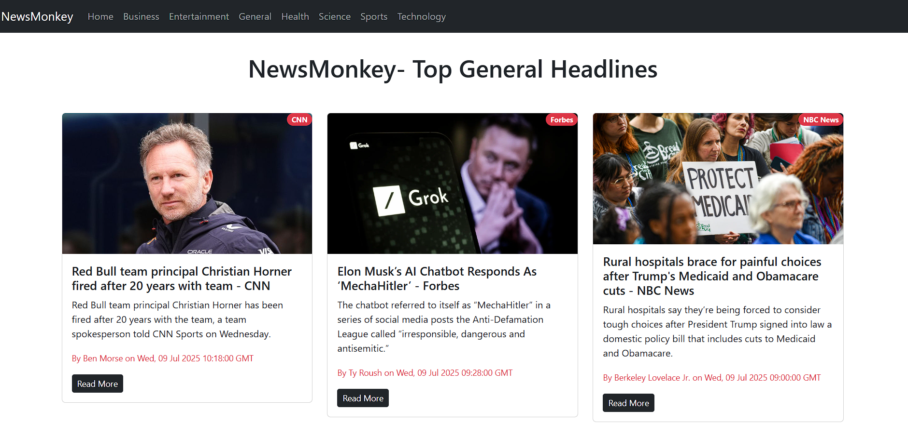
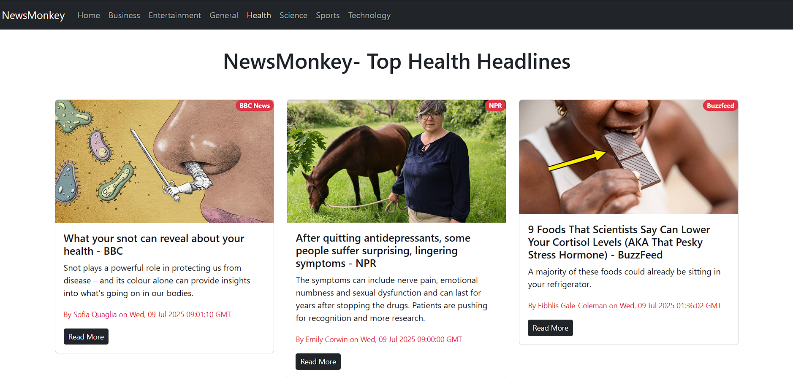
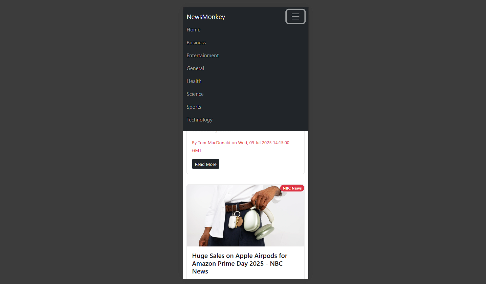

# 📰 NewsMonkey

**NewsMonkey** is a modern React-based news app that fetches the latest headlines using the [NewsAPI](https://newsapi.org/). It supports category browsing, is responsive across devices, and provides a clean UI for daily news reading.

---

## 🚀 Features

- 🔍 Browse news by categories like Business, Sports, Entertainment, Health, Science, and Technology
- 📰 Real-time news updates from NewsAPI.org
- ⚛️ Built with React and Tailwind CSS
- 📱 Fully responsive layout
- 🔄 Loading spinner while fetching data

---

## 📷 Screenshots

  
   
  Homepage with top headlines

  
   
  Browse news by category

  
   
  Responsiveness in mobile

---

## 🛠️ Tech Stack

- React JS
- Tailwind CSS
- React Router DOM
- NewsAPI

---
